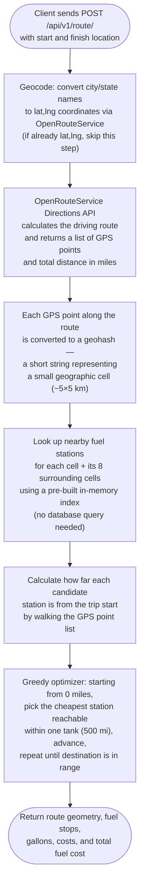
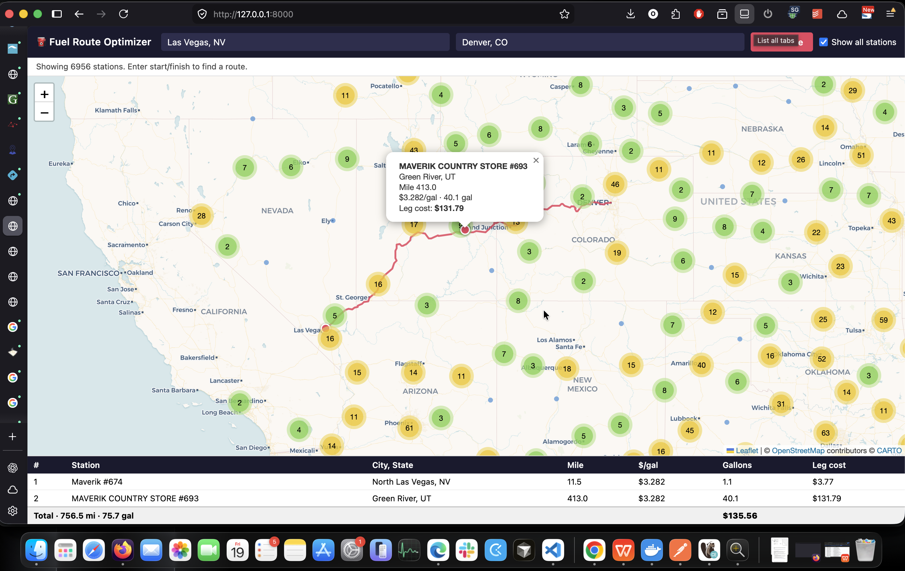
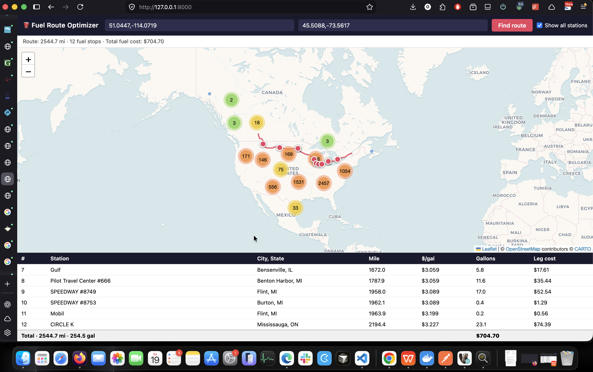

# Fuel Route Optimizer

A Django REST API that accepts a start and finish location, computes the optimal driving route, and returns the cheapest sequence of fuel stops along it — plus an interactive map to visualize everything.

---

## Table of contents

- [Overview](#overview)
- [Request flow](#request-flow)
- [Tech stack](#tech-stack)
- [Data pipeline](#data-pipeline)
- [Architecture decisions](#architecture-decisions)
  - [Routing & geocoding](#routing--geocoding)
  - [Spatial indexing](#spatial-indexing)
  - [Optimizer](#optimizer)
  - [Performance](#performance)
- [Project structure](#project-structure)
- [Setup](#setup)
  - [Prerequisites](#prerequisites)
  - [Run locally](#run-locally)
  - [Run with Docker](#run-with-docker)
- [API reference](#api-reference)
  - [POST /api/v1/route/](#post-apiv1route)
  - [GET /api/v1/stations/](#get-apiv1stations)
  - [GET /api/v1/health/](#get-apiv1health)
- [Map frontend](#map-frontend)
- [Running tests](#running-tests)
- [Linting](#linting)

---

## Overview

**One external call per request.** The entire pipeline after that is in-memory:

1. A single call to the [OpenRouteService](https://openrouteservice.org/) Directions API returns the route polyline and total distance.
2. The polyline points are converted to precision-5 geohash cells. Each cell plus its 8 neighbors is looked up in a pre-built in-memory dict (built once at startup from the DB). This is the spatial filter — no DB hit, no extra API call.
3. Each candidate station is projected onto the polyline to get a mile-marker (distance from the route start).
4. A greedy optimizer scans the sorted station list: from the current position, pick the **cheapest** station reachable within 500 miles, hop to it, repeat until the destination is within one tank.
5. The response is assembled and returned.

---

## Request flow



---

## Tech stack

| Layer | Choice |
|---|---|
| Framework | Django 5 + Django REST Framework |
| Routing API | OpenRouteService (`ORSRouteProvider`) |
| Geocoding | MapQuest batch geocoder |
| Spatial index | Geohash precision-5 dict, built at startup |
| Map UI | Leaflet + Leaflet.markercluster |
| DB | PostgreSQL (Docker) / SQLite (tests) |
| Server | Gunicorn (prod), `runserver` (dev) |
| Linting | Black + isort + flake8 via pre-commit |

---

## Data pipeline

The source CSV contains 8,151 raw station rows. Before geocoding, the data goes through cleanup and transformation:

- **Deduplication**: rows with the same name + city + state are collapsed into one — 8,151 raw rows → **6,956 unique stations**
- **Geocoding**: each unique station is geocoded once offline via `python manage.py geocode_stations_mapquest` and written to a JSON fixture
- **Quality tagging**: every station is tagged with a `geocode_source` based on match quality:
  - `precise` — MapQuest returned an address-level match and both city and state matched exactly **(4,982 stations, ~72%)**
  - `city_centroid` — address match failed the city/state check; coordinates fall back to the city centre **(1,974 stations, ~28%)**
- **Fixture load**: `python manage.py load_stations` loads the fixture into the DB and builds the in-memory geohash index at startup

---

## Architecture decisions

### Routing & geocoding

**OpenRouteService (ORS) for routing:**
- Sole routing backend; handles both geocoding and directions in one class (`ORSRouteProvider`)
- Free API key, no credit card required

#### Why MapQuest over Nominatim for geocoding

Nominatim is the geocoding engine behind OpenStreetMap — free but rate-limited to 1 req/sec, making bulk geocoding impractical at this scale.

**MapQuest over Nominatim:**
- **Speed**: MapQuest batches 100 addresses per POST (~82 calls total, no rate limit). Nominatim would take ~2.5 hours for the same dataset
- **Precision**: MapQuest returned ~72% address-level results vs ~10% for Nominatim on this dataset
- **Validation**: City and state must both match exactly; otherwise falls back to `city_centroid`

---

### Spatial indexing

**Geohash precision-5 in-memory dict:**
- Each station stores a precomputed `geohash` (precision 8) at load time
- At startup, `StationsConfig.ready()` builds `dict[geohash_prefix_5 → [stations]]` in one DB query — zero DB hits per request
- Each route point is looked up against its cell + 8 neighbors (9 cells total); the 8-neighbor expansion is mandatory to catch stations sitting on a cell boundary
- At 500-mile range / 10 mpg, whether a station is 1–4 km off the highway has negligible cost impact — exact-radius filtering is unnecessary

**Geohash precision reference** ([source](https://en.wikipedia.org/wiki/Geohash)):

| Precision | Cell width | Cell height | Used here |
|---|---|---|---|
| 1 | ≤ 5,000 km | ≤ 5,000 km | |
| 2 | ≤ 1,250 km | ≤ 625 km | |
| 3 | ≤ 156 km | ≤ 156 km | |
| 4 | ≤ 39.1 km | ≤ 19.5 km | |
| **5** | **≤ 4.9 km** | **≤ 4.9 km** | **Spatial index keys and route corridor lookups** |
| 6 | ≤ 1.2 km | ≤ 0.61 km | |
| 7 | ≤ 153 m | ≤ 153 m | |
| **8** | **≤ 38.2 m** | **≤ 19.1 m** | **Stored on each `FuelStation` row at load time** |
| 9 | ≤ 4.8 m | ≤ 4.8 m | |
| 10 | ≤ 1.2 m | ≤ 0.6 m | |
| 11 | ≤ 14.9 cm | ≤ 14.9 cm | |
| 12 | ≤ 3.7 cm | ≤ 1.9 cm | |

Precision 5 is the lookup granularity; precision 8 is stored purely so the index build is a cheap string slice (`geohash[:5]`) rather than a re-encode at startup.

---

### Optimizer

**Greedy "cheapest reachable" algorithm:**
- From current position, pick the cheapest station within one tank (500 miles), advance, repeat until destination is in range
- Greedy is chosen over dynamic programming — fast, readable, and accurate enough for practical routes at 10 mpg / 500 mi

**Fuel model:**
- Tank is assumed full at trip start; no current fuel level is tracked
- Each stop purchases exactly `leg_miles / MPG` gallons to reach the next stop — leftover fuel is never carried forward
- Routes under 500 miles return an empty `fuel_stops` list

---

### Performance

**Cumulative distances pre-computation:**
- `cumulative_distances()` runs once per request, building a running mile-marker array over the full polyline
- `station_mile_marker()` is then called once per candidate station (potentially hundreds) — a linear scan of that array, no repeated haversine sums

---

## Project structure

```
config/
  settings/
    base.py          Core Django settings; imports app_settings.py
    app_settings.py  All app-wide constants (URLs, paths, tuning params)
    dev.py / prod.py / test.py
stations/        Station data, geocoding management commands, spatial index
routing/         Route provider, geometry helpers, greedy optimizer, API views
frontend/        Leaflet map template view
templates/       Project-root templates (map.html)
data/            Source CSV (fuel-prices-for-be-assessment.csv)
.envs/           Env files (.env.example committed; .env.local gitignored)
```

---

## Setup

### Prerequisites

- Docker & Docker Compose, **or** Python 3.10+ and PostgreSQL

### Environment variables

```bash
cp .envs/.env.example .envs/.env.local
```

Edit `.envs/.env.local` and set:

| Variable | Required | Where to get it |
|---|---|---|
| `ORS_API_KEY` | Yes | [openrouteservice.org/dev/#/login](https://openrouteservice.org/dev/#/login) — free, no credit card |
| `MAPQUEST_API_KEY` | Only to re-geocode | [developer.mapquest.com](https://developer.mapquest.com/account/user/login) — generous free tier |

All DB variables default to the Docker Compose Postgres service and need no changes for local Docker use.

> **Station fixture** — `stations/fixtures/stations_geocoded_mapquest.json` is already committed and loaded automatically at startup. Only re-run the geocoder if the source CSV changes:
> ```bash
> python manage.py geocode_stations_mapquest   # requires MAPQUEST_API_KEY
> python manage.py load_stations               # reload the DB from the updated fixture
> ```

### Run locally

```bash
# Create and activate virtualenv
python3 -m venv .venv && source .venv/bin/activate
pip install -r requirements.txt

# Create Postgres DB (if not already set up)
psql -U postgres -c "CREATE USER postgres"
psql -U postgres -c "ALTER USER postgres WITH PASSWORD 'postgres'"
psql -U postgres -c "CREATE DATABASE spotter_db"

# Apply migrations and load station data
python manage.py migrate
python manage.py load_stations
python manage.py collectstatic

# Start the development server
python manage.py runserver
```

The API is available at `http://localhost:8000`.

### Run with Docker

```bash
docker-compose up -d --build
```

The container runs `migrate` → `load_stations` → `collectstatic` → Gunicorn automatically. The API is ready at `http://localhost:8000`.

---

## API reference

### `POST /api/v1/route/`

Returns the driving route, optimal fuel stops, and total cost.

> Routes under 500 miles return an empty `fuel_stops` list — the full tank covers the trip with no stops needed.

**Request body:**

| Field | Type | Description |
|---|---|---|
| `start` | string | Starting location — city/state name or `"lat,lng"` |
| `finish` | string | Destination — city/state name or `"lat,lng"` |

**Example — place names (Las Vegas, NV → Denver, CO):**

```bash
curl 'http://127.0.0.1:8000/api/v1/route/' \
  -X POST \
  -H 'Content-Type: application/json' \
  --data-raw '{"start":"Las Vegas, NV","finish":"Denver, CO"}'
```

```json
{
  "route": {
    "geometry": [[36.190483, -115.278893], [36.191226, -115.279537], "... 1,400+ more points ..."],
    "total_distance_miles": 748.96,
    "total_gallons": 74.9
  },
  "fuel_stops": [
    {
      "name": "MAVERIK #397",
      "city": "St. George",
      "state": "UT",
      "price_per_gallon": 3.539,
      "distance_from_start_miles": 123.4,
      "gallons_purchased": 12.3,
      "leg_cost": 43.53,
      "latitude": 37.1041,
      "longitude": -113.5841
    },
    {
      "name": "PILOT TRAVEL CENTER #0633",
      "city": "Salina",
      "state": "UT",
      "price_per_gallon": 3.679,
      "distance_from_start_miles": 417.8,
      "gallons_purchased": 29.4,
      "leg_cost": 108.16,
      "latitude": 38.9554,
      "longitude": -111.8622
    }
  ],
  "total_fuel_cost": 258.34
}
```




**Example — lat/lng coordinates (Calgary, AB → Montreal, QC):**

```bash
curl 'http://127.0.0.1:8000/api/v1/route/' \
  -X POST \
  -H 'Content-Type: application/json' \
  --data-raw '{"start":"51.0447,-114.0719","finish":"45.5088,-73.5617"}'
```

```json
{
  "route": {
    "geometry": [[51.044666, -114.071903], [51.044691, -114.072726], "... 3,800+ more points ..."],
    "total_distance_miles": 2126.43,
    "total_gallons": 212.64
  },
  "fuel_stops": [
    {
      "name": "PETRO CANADA #1042",
      "city": "Medicine Hat",
      "state": "AB",
      "price_per_gallon": 3.829,
      "distance_from_start_miles": 183.6,
      "gallons_purchased": 18.4,
      "leg_cost": 70.45,
      "latitude": 50.0405,
      "longitude": -110.6764
    },
    {
      "name": "HUSKY TRAVEL CENTRE",
      "city": "Swift Current",
      "state": "SK",
      "price_per_gallon": 3.749,
      "distance_from_start_miles": 412.1,
      "gallons_purchased": 22.9,
      "leg_cost": 85.85,
      "latitude": 50.2853,
      "longitude": -107.7982
    },
    "... 2 more stops ..."
  ],
  "total_fuel_cost": 791.22
}
```



**Error responses:**

| Status | Condition |
|---|---|
| 400 | Missing/blank `start` or `finish`; location not found by geocoder |
| 422 | No driving route found between the two points; unreachable fuel gap > 500 miles |

---

### `GET /api/v1/stations/`

Returns all 6,956 geocoded stations as a flat JSON list. Used by the map's "Show all stations" toggle.

```bash
curl -s http://localhost:8000/api/v1/stations/ | head -c 500
```

```json
[
  {"name":"WOODSHED OF BIG CABIN","city":"Big Cabin","state":"OK","price":"3.0073","latitude":36.56599,"longitude":-95.22145},
  {"name":"KWIK TRIP #796","city":"Tomah","state":"WI","price":"3.2873","latitude":44.0192,"longitude":-90.50207},
  {"name":"PILOT TRAVEL CENTER #1243","city":"Gila Bend","state":"AZ","price":"3.8990","latitude":32.92976,"longitude":-112.67314},
  "... 6,953 more ..."
]
```

---

### `GET /api/v1/health/`

Readiness probe. Returns `{"status": "ok", "station_index_loaded": true}` when the app is up and the spatial index is loaded.

```bash
curl -s http://localhost:8000/api/v1/health/
# {"status": "ok", "station_index_loaded": true}
```

---

## Map frontend

The root URL (`GET /`) serves an interactive Leaflet map.

**Features:**
- Enter start and finish locations by name or coordinates and hit **Find Route**
- The driving route is drawn as a polyline; optimal fuel stops are plotted as markers
- Each stop marker shows station name, price per gallon, gallons purchased, and leg cost
- **Show all stations** toggle renders all 6,956 stations as clustered markers (clusters expand on zoom)
- Clicking any station marker shows its name, city/state, and current price

**Demo:**

[Video walkthrough](https://github.com/osamanadeem9/spotter-task/raw/develop/screenshots/3.mov)

---

## Running tests

```bash
pytest
```

The suite uses SQLite (`:memory:`) — no Postgres needed. All external HTTP is mocked via the `responses` library.

---

## Linting

```bash
pre-commit install           # one-time: install git hooks
pre-commit run --all-files   # Black + isort + flake8
```
